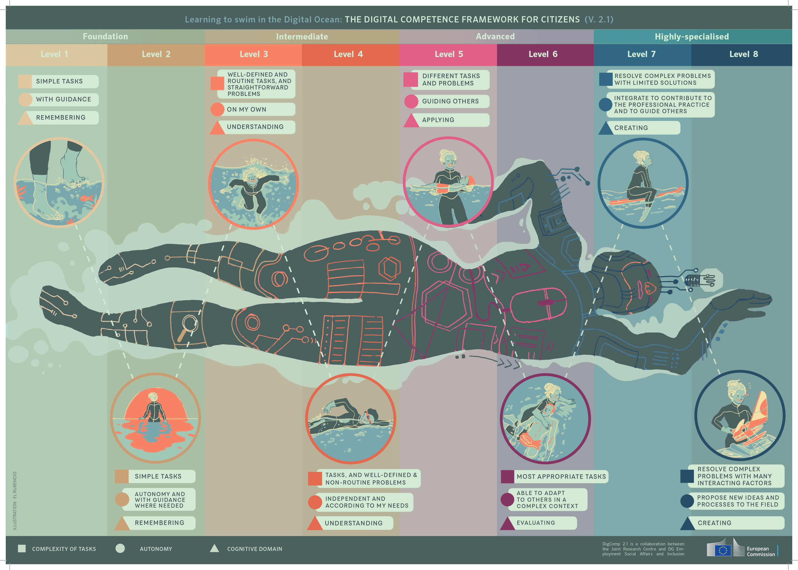

### Introdução

Este documento, enriquecido com pesquisa acadêmica e industrial, oferece uma análise aprofundada dos impactos éticos do aplicativo móvel desenvolvido para o gerenciamento do reabastecimento das farmácias ambulantes no Hospital Sírio-Libanês, abordando cinco dimensões éticas principais.

#### 1. Privacidade e Proteção de Dados

**Coleta e Uso de Dados:**
O aplicativo manipula dados sensíveis de identificação dos funcionários, requerendo medidas de segurança como criptografia e controle de acesso restrito. A segurança em aplicações de saúde deve priorizar estas tecnologias para proteger a privacidade dos usuários. É vital adotar tecnologias avançadas de proteção, como aquelas descritas pela [Journal of Big Data - Security of Big Healthcare Data](https://journalofbigdata.springeropen.com/articles/10.1186/s40537-019-0197-0) e pela [Cloud Security Alliance - Healthcare Cybersecurity](https://cloudsecurityalliance.org/artifacts/healthcare-cybersecurity-8-data-protection-best-practices/), que ressaltam a importância da segurança em aplicações de saúde para proteger a privacidade dos usuários.

**Armazenamento de Dados:**
Os dados são protegidos por tecnologias de criptografia avançada, com acesso limitado a usuários autorizados. A implementação de uma arquitetura de segurança multicamadas é recomendada para proteger dados sensíveis contra acessos não autorizados. Os dados são armazenados utilizando tecnologias de criptografia avançada, com acesso limitado a usuários autorizados, seguindo as melhores práticas indicadas por fontes como a [Lepide - Healthcare Data Security](https://www.lepide.com/blog/healthcare-data-security-best-practices-common-threats-and-hipaa/) e [HIMSS - Cybersecurity in Healthcare](https://www.himss.org/resources/cybersecurity-in-healthcare).

**Conformidade Regulatória:**
O aplicativo está em conformidade com a Lei Geral de Proteção de Dados (LGPD), e outras regulamentações, garantindo a integridade e a confidencialidade dos dados dos usuários. Estudos destacam a importância do cumprimento da LGPD em tecnologias de saúde. Publicações como a [HealthTech Magazine, 2023](https://healthtechmagazine.net/article/2023/03/vive-2023-maintaining-security-and-privacy-patient-data-grows) e a [Bluefin, 2023](https://www.bluefin.com/bluefin-news/healthcare-data-breaches-2023-trends-impact-strategies-protection/) destacam a importância do cumprimento da LGPD e outras normas em tecnologias de saúde, especialmente no contexto de aumento das violações de dados.

#### 2. Equidade e Justiça

**Impacto nos Grupos Específicos:**
É crucial garantir que o acesso ao aplicativo seja universal e inclusivo, oferecendo treinamentos para minimizar barreiras de uso entre funcionários com diferentes habilidades tecnológicas.

**Minimização de Disparidades:**
Treinamentos e suporte técnico são oferecidos regularmente para garantir que todos os funcionários possam utilizar o aplicativo eficientemente, promovendo um ambiente de trabalho equitativo.

**Desafios de Acesso e Uso do Robô Assistente:**
A implementação desta tecnologia pode revelar disparidades no acesso e na capacidade de utilizar o robô assistente de maneira eficaz. A linguagem utilizada pelo robô e o nível de literacia digital necessário podem ser barreiras significativas, especialmente para usuários de comunidades marginalizadas ou com menos acesso à educação tecnológica. Além disso, o risco de viés nas soluções fornecidas pelo robô, baseadas nos dados com os quais foi treinado, pode limitar sua eficácia em situações com equipamentos mais antigos ou menos comuns. Diante disso, a análise da competência digital dos cidadãos pela União Europeia ajudou a identificar que pessoas entre os níveis 1 a 3 podem necessitar de instruções detalhadas e apoio adicional para adaptar-se à tecnologia, considerando aqueles sem afinidade tecnológica ou com deficiências físicas ou cognitivas.

#### 3. Transparência e Consentimento Informado

**Acesso à Informação:**
O aplicativo inclui uma seção detalhada sobre a coleta e uso de dados, garantindo transparência total. É essencial que as organizações garantam clareza nas informações sobre coleta e uso de dados para aumentar a confiança dos usuários, como sugerido pelo [GDPR Advisor](https://www.gdpr-advisor.com).

**Consentimento:**
Antes da utilização, os usuários são informados sobre as práticas de dados e devem consentir explicitamente com elas. Documentar e manter registros do consentimento obtido é crucial para que os usuários possam gerenciar suas preferências de dados e retirar o consentimento se desejarem, seguindo diretrizes de conformidade com o [GDPR Advisor](https://www.gdpr-advisor.com)
.

#### 4. Responsabilidade Social

**Impacto Social Positivo:**
A eficiência aumentada no reabastecimento de medicamentos contribui significativamente para a melhoria do atendimento ao paciente e a redução de erros médicos. O uso eficiente de medicamentos não apenas melhora o atendimento ao paciente, mas também reduz custos operacionais.

**Impacto Ambiental:**
O aplicativo favorece o uso eficiente de recursos, minimizando desperdícios e promovendo a sustentabilidade ao otimizar o estoque de medicamentos, conforme práticas gerais de gestão sustentável de recursos em contextos hospitalares.

#### 5. Viés e Discriminação

**Risco de Viés Algorítmico:**
O design e a implementação do aplicativo foram revisados para evitar vieses, com algoritmos que não favorecem nenhum grupo de usuários sobre outros. Auditorias regulares e atualizações de algoritmos são essenciais para identificar e corrigir quaisquer vieses ou discriminações inadvertidas.

**Mitigação de Viés:**
Continuaremos monitorando o aplicativo para garantir um tratamento justo e igualitário para todos os usuários. Estratégias incluem auditorias regulares e atualizações de algoritmos

### Conclusão

Este aplicativo propõe uma solução tecnológica que melhora significativamente a eficiência operacional no Hospital Sírio-Libanês, respeitando altos padrões éticos e promovendo uma gestão de medicamentos mais eficiente e justa.

Aqui estão suas referências reorganizadas por tópico, facilitando a consulta e a compreensão dos temas abordados:

### Referências

#### 1. **Privacidade e Proteção de Dados na Saúde**

- **Preservando a segurança e privacidade de grandes dados de saúde**:
    - [Journal of Big Data - Security of Big Healthcare Data](https://journalofbigdata.springeropen.com/articles/10.1186/s40537-019-0197-0)

- **Dicas para proteger dados de saúde privados**:
    - [Digital Guardian - Healthcare Cybersecurity Tips](https://digitalguardian.com/blog/healthcare-cybersecurity-tips-securing-private-health-data)

- **Best Practices for Healthcare Cybersecurity**:
    - [Cloud Security Alliance - Healthcare Cybersecurity](https://cloudsecurityalliance.org/artifacts/healthcare-cybersecurity-8-data-protection-best-practices/)
    
- **Segurança de dados em saúde e melhores práticas**:
    - [Lepide - Healthcare Data Security](https://www.lepide.com/blog/healthcare-data-security-best-practices-common-threats-and-hipaa/)

- **Cybersecurity in Healthcare**:
    - [HIMSS - Cybersecurity in Healthcare](https://www.himss.org/resources/cybersecurity-in-healthcare)

- **Proteção de Dados em Ambientes Complexos**:
    - A proteção de dados em ambientes de saúde está se tornando cada vez mais desafiadora com a crescente quantidade de dados coletados e a complexidade dos ataques cibernéticos. É fundamental que as organizações de saúde mantenham a privacidade e segurança dos dados, tratando-os como uma prioridade contínua [HealthTech Magazine, 2023](https://healthtechmagazine.net/article/2023/03/vive-2023-maintaining-security-and-privacy-patient-data-grows).

- **Tendências e Impactos das Violações de Dados**:
    - Em 2023, embora o número de violações de dados tenha diminuído, o número de pessoas afetadas aumentou significativamente, evidenciando que os cibercriminosos estão se tornando mais estratégicos em seus ataques [Bluefin, 2023](https://www.bluefin.com/bluefin-news/healthcare-data-breaches-2023-trends-impact-strategies-protection/).
    
- **Esforços Federais para Melhorar a Cibersegurança na Saúde**:
    - O governo dos EUA está aumentando seus esforços para melhorar a cibersegurança no setor de saúde, incluindo a implementação de estratégias nacionais e a colaboração público-privada para fortalecer o ecossistema digital contra ameaças cibernéticas [AHIMA Journal, 2023](https://journal.ahima.org/page/federal-cybersecurity-efforts-seek-to-improve-protection-of-health-data).

#### 2. **Equidade e Justiça**
   - Sem links específicos, baseado em práticas gerais de acessibilidade e inclusão.

#### 3. **Transparência e Consentimento Informado**
   - **Conformidade com GDPR na indústria da saúde**:
     - [GDPR Advisor](https://www.gdpr-advisor.com)

#### 4. **Responsabilidade Social**
   - Sem links específicos, baseado em práticas gerais de sustentabilidade e eficiência em gestão de recursos no contexto hospitalar.

#### 5. **Viés e Discriminação**
   - Sem links específicos, baseado em práticas gerais de revisão e auditoria de algoritmos para evitar viés.