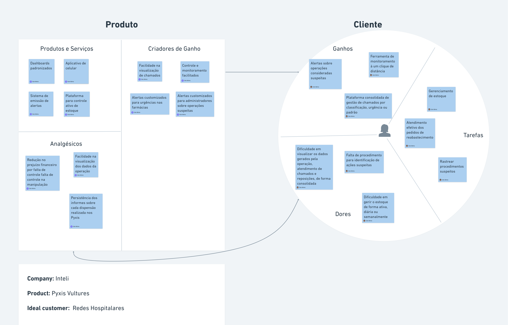

import { Card, CardGrid } from '@astrojs/starlight/components';

## O que é o Canvas de Proposta de Valor?

O Canvas de Proposta de Valor é uma ferramenta que ajuda a descrever e projetar a proposta de valor de um produto ou serviço. Ele é composto por seis blocos que ajudam a entender o que os clientes valorizam e como o produto ou serviço atende às suas necessidades. Quais seriam estes blocos? São eles:

1. **Ganhos:** O que facilita a vida dos usuários e os ajuda a alcançar seus objetivos.
2. **Tarefas:** Quais são as tarefas que os usuários precisam realizar no dia a dia.
3. **Dores:** Quais são as dores e desafios que os usuários enfrentam.
4. **Analgésicos:** Como o produto pode aliviar ou solucionar as principais dores dos usuários 
5. **Produtos e Serviços:** Quais ferramentas ajudam os usuários a realizar suas tarefas.
6. **Criadores de Ganho:** Quais são os benefícios pessoais que os usuários obtêm ao usar o produto.

## Afinal, o que é uma proposta de valor?

Uma proposta de valor nada mais é do que uma promessa de valor a ser entregue. É a principal razão pela qual uma pessoa deve comprar de você ou utilizar seus serviços. É uma declaração clara que explica como seu produto resolve os problemas dos clientes ou melhora sua situação, entrega benefícios específicos e diz ao cliente ideal por que ele deve comprar de você e não da concorrência.

## Proposta de valor do projeto

A proposta de valor do projeto é fornecer uma plataforma que permita ao Hospital Sírio-Libanês gerenciar não só seu estoque, mas seus processos de urgência relacionados ao abastecimento de dispensários e segurança quanto à manipulação dos medicamentos neles contidos. A plataforma permitirá que o hospital migre seus sistema de chamados às unidades de farmácia, valendo salientar que este está acoplado ao Whatsapp atualmente, faça controle ativo dos estoques, evitando prejuízos financeiros, além de alertas havendo ocorrências de processos suspeitos na retirada de items das unidades de armazenamento, Pyxis, contidas nas instalações. Para além das funcionalidades elencadas, a plataforma permitirá que o hospital faça levantamentos de dados para análise de desempenho do atendimento aos pedidos de reposição realizados pelas unidades de atendimento e rastreabilidade de procedimentos classificados como suspeitos através API's e um dashboard de controle e monitoramento.

## Como o Canvas de Proposta de Valor se aplica ao projeto?

Utilizando o Canvas de Proposta de Valor, podemos descrever a proposta de valor do projeto de forma clara e concisa. O Canvas nos ajuda a entender o que os usuários valorizam e como o projeto atende às suas necessidades. Com base nos seis blocos do Canvas, podemos descrever os ganhos, tarefas, dores, analgésicos, produtos e serviços e criadores de ganho do projeto.

Desta forma, pensando no projeto Pyxis Vulture, podemos descrever a proposta de valor do projeto da seguinte forma:

