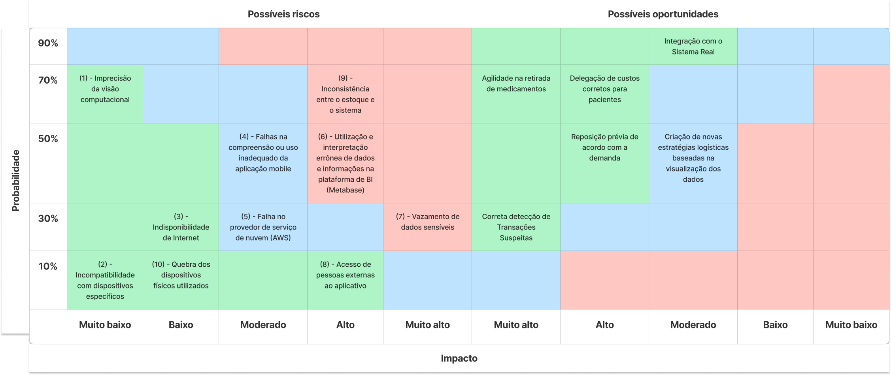

## Introdução

A análise de riscos é um processo fundamental para identificar, avaliar e mitigar potenciais ameaças e incertezas que podem impactar o sucesso e a sustentabilidade de uma empresa. Trata-se de uma prática proativa que visa antecipar cenários adversos, permitindo que as organizações estejam preparadas para lidar com desafios e tomar decisões informadas.

## Matriz de Risco

A Matriz de Risco é uma ferramenta que auxilia na identificação e avaliação de riscos em um projeto. Ela é composta por uma matriz de dupla entrada, na qual os riscos são classificados de acordo com sua probabilidade de ocorrência e impacto no projeto. A partir dessa classificação, é possível priorizar os riscos e definir estratégias para mitigá-los. No contexto do projeto, projetamos a seguinte matriz de risco:

## Mitigação de riscos

A mitigação de riscos é um processo contínuo que envolve a identificação, avaliação e implementação de estratégias para reduzir a probabilidade de ocorrência e o impacto dos riscos identificados. Neste contexto, elaboramos um plano de ação para mitigar os riscos identificados na matriz de risco do projeto. As estratégias de mitigação incluem:

<ol>
    <li> Garantir o treinamento correto do modelo de visão computacional e sua otimização para o funcionamento no contexto do projeto</li>
    <li> Utilizar tecnologias que resolvam problemas de compatibilidade; Garantir a atualização de sistemas e dispositivos legados</li>
    <li> Instalação de pontos de rede em áreas com sinal fraco; Projetar uma infraestrutura capaz de lidar com desconexões e indisponibilidade de rede</li>
    <li> Incluindo mal gerenciamento de estoque (refletindo diretamente no propósito da solução) e tempo para aprendizado para utilizar a aplicação. Desenvolver uma interface intuitiva e pré-projetada que minimize a possibilidade de entradas incorretas, mas ainda altamente customizáveis. Padronização de entradas e treinamento dos funcionários.</li>
    <li> Garantir a distribuição do serviço em várias regiões de disponibilidade; Utilizar diversos provedores de nuvem</li>
    <li> Garantir a extração de informações corretas dos dados através de gráficos simples e intuitivos em uma plataforma altamente personalizável com baixa margem de erros. Treinamento de colaboradores para utilizar corretamente a solução a fim de fazrer tomadas de decisões mais assertivas.</li>
    <li> Pensando em falhas de segurança do sistema e ataques cibernéticos. Manutenção da segurança dos sistemas utilizando tecnologias, protocolos e métodos que asseguram a confidencialidade, integridade e disponibilidade das informações</li>
    <li> Autenticação do usuário baseado nos empregados do registro da instituição</li>
    <li> Garantia de redundância dos dados, além da criação de logs do sistema para acompanhamento das operações</li>
    <li> Manutenção contínua dos dispositivos, além da confecção de cases de proteção para o hardware</li>
</ol>

