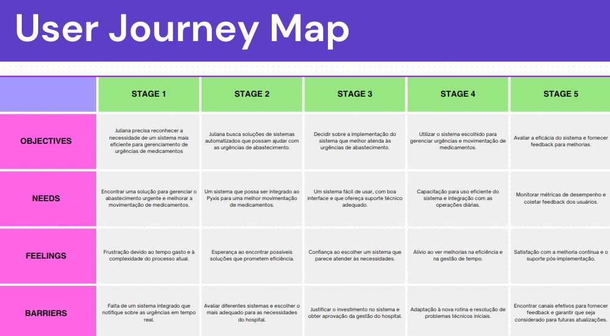
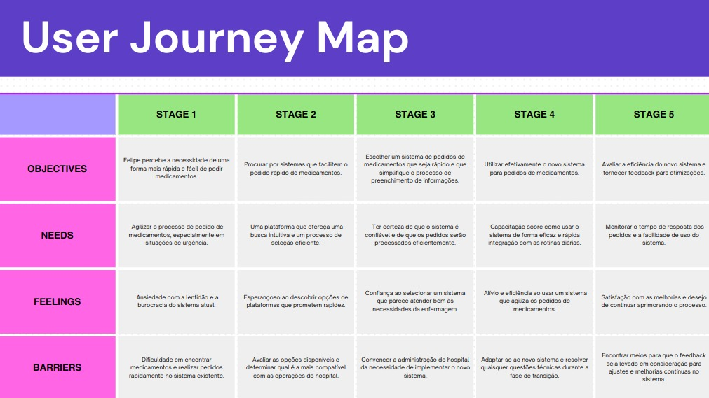

## Introdução

O mapa da jornada do usuário é uma representação visual da experiência do usuário ao interagir com um produto ou serviço. Ele descreve o processo que um usuário passa ao realizar uma tarefa específica, identificando as etapas, as emoções e as oportunidades de melhoria ao longo do caminho.

## Mapa da Jornada do Usuário

### Juliana Souza

### Felipe Mello

