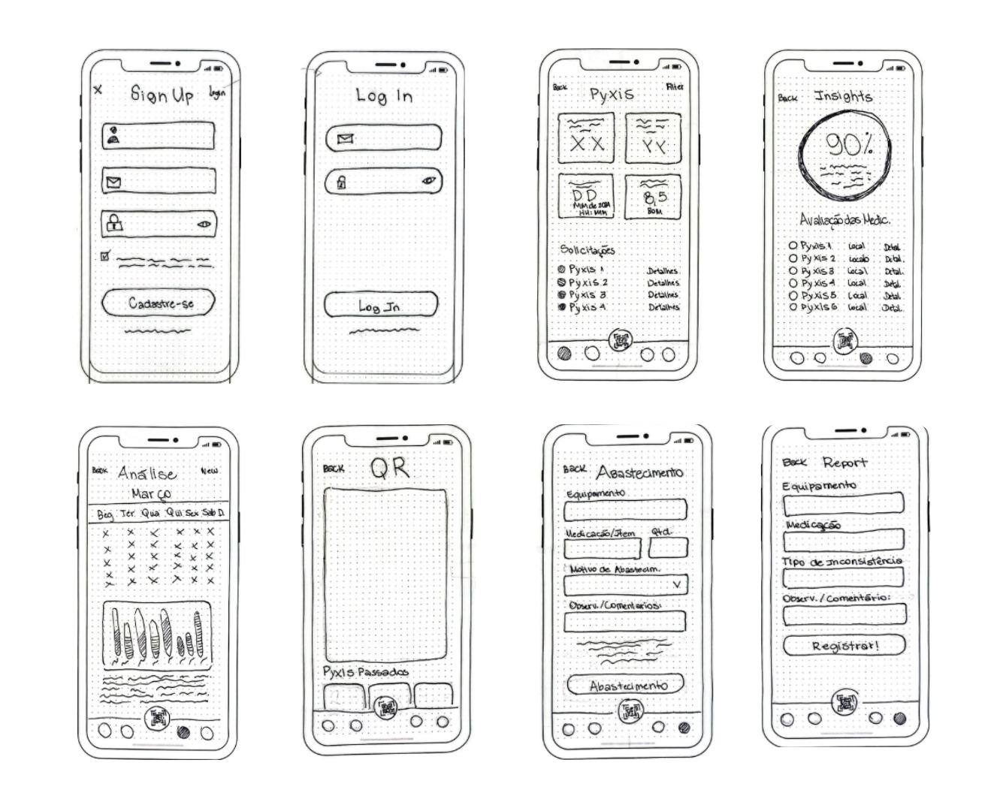

O wireframe é uma representação visual de baixa fidelidade de uma interface de usuário, frequentemente utilizada no início do processo de design de um projeto de software. Ele serve como um esboço inicial que delineia a estrutura e o layout das diferentes telas ou páginas da aplicação, destacando os elementos principais e a organização geral da informação.

## Mockup de Interface
- Layout: Define a estrutura básica da página, incluindo a disposição de elementos como cabeçalho, menu, conteúdo principal e rodapé.
- Componentes de Interface: Representa os elementos interativos da interface, como botões, campos de entrada, menus e caixas de diálogo.

Para isso foi desenvolvida uma base, com desenhos reais para entendermos melhor a estrutura da visualização das funcionalidades do sistema:

## Protótipo Interativo

Após a definição dos requisitos e da arquitetura da informação, avançamos para a fase de criação de um protótipo interativo utilizando a plataforma Figma. O foco foi na prototipação mobile, garantindo uma experiência de usuário otimizada para dispositivos móveis.

O processo de prototipação no Figma envolveu a criação de wireframes de baixa fidelidade inicialmente, para esboçar a estrutura e o layout básico das telas. Esses wireframes foram refinados gradualmente, adicionando detalhes de design e interatividade à medida que o protótipo evoluía.

1. Nível Administrativo
<iframe width="560" height="315" src="https://www.youtube.com/embed/Xb2jXXmjfsk?si=nSNYrhzGCKJSIsYR" title="YouTube video player" frameborder="0" allow="accelerometer; autoplay; clipboard-write; encrypted-media; gyroscope; picture-in-picture; web-share" referrerpolicy="strict-origin-when-cross-origin" allowfullscreen></iframe>

2. Nível de Operação
<iframe width="560" height="315" src="https://www.youtube.com/embed/EiOwItVapUM?si=5erqdMgg4cZ-z00r" title="YouTube video player" frameborder="0" allow="accelerometer; autoplay; clipboard-write; encrypted-media; gyroscope; picture-in-picture; web-share" referrerpolicy="strict-origin-when-cross-origin" allowfullscreen></iframe>

### Funcionalidades:
- Sistema de Login e Verificação de Usuários 
- Dashboard de Visualização de Informações e Acompanhamento dos Equipamentos 
- Registro de Inconsistências
- Acompanhamento do Pedido 
- Histórico e Inconsistência