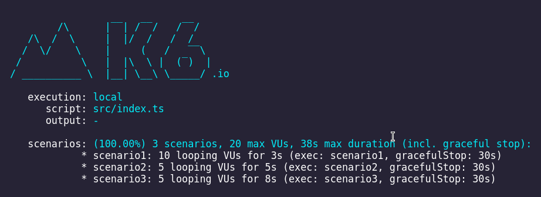
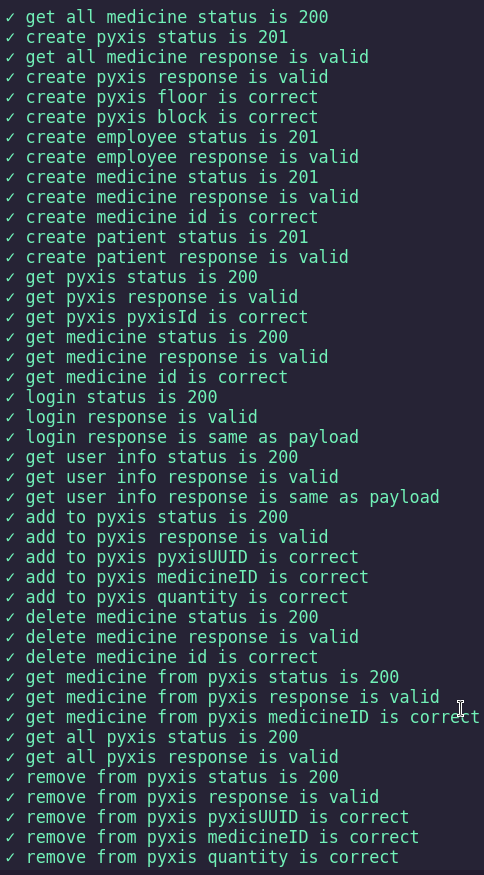
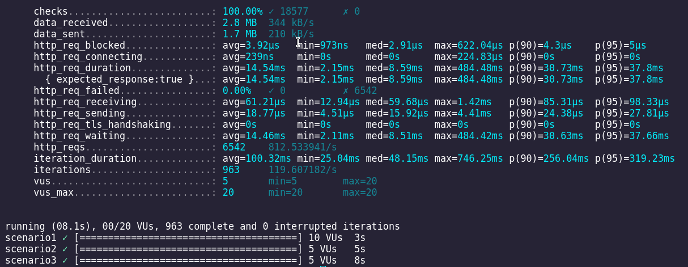

# Testes de Carga utilizando o Framework TypeScript k6

## Introdução

Os testes de carga são essenciais para garantir que um sistema possa lidar com a demanda esperada de usuários e transações, sem comprometer sua performance, estabilidade ou segurança. Nesta documentação, exploraremos o que são testes de carga, sua importância para decisões arquiteturais do sistema, e como o framework TypeScript k6 pode ser utilizado para implementá-los.

## O que são testes de carga?

Testes de carga são uma forma de avaliar o comportamento de um sistema sob condições de carga simuladas, onde a carga pode representar o número de usuários simultâneos, transações por segundo, volume de dados, entre outros. O objetivo principal é identificar possíveis gargalos, falhas de performance e determinar a capacidade máxima do sistema.

## Importância para decisões arquiteturais do sistema

Os testes de carga desempenham um papel crucial na definição da arquitetura do sistema, pois fornecem insights valiosos sobre o desempenho e escalabilidade da aplicação. Com base nos resultados dos testes de carga, os arquitetos de sistemas podem:

    - Identificar e mitigar possíveis gargalos de performance.
    - Dimensionar adequadamente os recursos necessários, como servidores, bancos de dados e redes.
    - Validar se as tecnologias e frameworks escolhidos são adequados para lidar com a carga prevista.
    - Projetar estratégias de escalabilidade horizontal ou vertical conforme necessário.
    - Estimar os custos operacionais associados à infraestrutura de hospedagem e manutenção do sistema.

## O framework TypeScript k6

O k6 é uma ferramenta de teste de carga de código aberto e oferece suporte para scripts escritos em JavaScript ou TypeScript. Ele se destaca por sua simplicidade de uso, eficiência e capacidade de execução de testes distribuídos.
Características principais do k6:

    - JavaScript/TypeScript: Permite escrever scripts de teste utilizando a linguagem familiar JavaScript ou TypeScript, o que facilita a integração com outras ferramentas e frameworks.
    - Sintaxe Limpa: Possui uma sintaxe limpa e fácil de entender, o que simplifica a criação e manutenção de scripts de teste.
    - Suporte a HTTP/HTTPS: Oferece suporte nativo para testes de carga em aplicações web, permitindo simular requisições HTTP/HTTPS e analisar o desempenho do servidor.
    - Métricas e Thresholds: Permite definir métricas de desempenho e thresholds para avaliar se o sistema atende aos requisitos de performance estabelecidos.
    - Execução Distribuída: Capacidade de distribuir a execução de testes em vários nós, facilitando a simulação de grandes volumes de usuários.
    - Integração com CI/CD: Pode ser facilmente integrado a pipelines de CI/CD para automatizar a execução de testes de carga em cada versão do sistema.

## Exemplo de script de teste utilizando k6 (TypeScript)

Aqui está um exemplo de script de teste de carga escrito em TypeScript utilizando o framework k6:

```typescript

import http from 'k6/http';
import { sleep, randomIntBetween } from 'k6';

export const options = {
    thresholds: {
        http_req_failed: ['rate<0.05'],
        http_req_duration: ['p(95)<300'],
    },
    vus: 10,
    duration: '30s',
};

export default function () {
    const baseUrl = 'http://localhost:3000';

    http.get(baseUrl);
    http.get(baseUrl + '/pyxis');
    http.get(baseUrl + '/catalog');

    const pyxisPayload = JSON.stringify({ floor: randomIntBetween(1, 11), block: 'exampleBlock' });
    http.post(baseUrl + '/pyxis', pyxisPayload, { headers: { 'Content-Type': 'application/json' } });

    const catalogPayload = JSON.stringify({ name: 'exampleMedicineName' });
    http.post(baseUrl + '/catalog', catalogPayload, { headers: { 'Content-Type': 'application/json' } });

    sleep(1);
};
```

Este script simula uma carga de 10 usuários durante 30 segundos, realizando requisições HTTP GET e POST para endpoints específicos da aplicação.

## Executando testes de carga com k6

Para executar o script de teste de carga com k6, basta instalar o k6 CLI e executar o comando `k6 run` com o arquivo de script como argumento:

import { Steps } from '@astrojs/starlight/components';

<Steps>

1. Clone o repositorio do projeto e vá para a pasta `load-test`:
    ```bash
    git clone https://github.com/Inteli-College/2024-1B-T02-EC10-G03.git
    cd 2024-1B-T02-EC10-G03/src/load-test
    ```

2. Instale as dependências localizadas na pasta `load-test`:
    ```bash
    bun install
    ```

3. Agrupe os arquivos TypeScript:
    ```bash
    # Se tiver o bun instalado
    bun bundle

    # Se não tiver o bun instalado
    npm run bundle
    ```

4. Defina o Hostname:
    ```bash
    export HOSTNAME="your_hostname_here"
    ```

5. Rode os testes de carga com o k6:
    ```bash
    k6 run dist/index.test.js
    ```

</Steps>

## Métricas obtidas utilizando o k6

Rodando o teste para a API desenvolvida, obtivemos as seguintes métricas:








Observando as métricas, temos que:

- `checks` - Número de verificações executadas durante o teste. Houve 100% de sucesso nas verificações.
- `http_req_duration` - Duração média das requisições HTTP. O percentil 95 foi de 5 microsegundos e a média foi de 3.92 microsegundos.
- `http_req_failed` - Número de requisições HTTP que falharam durante o teste. Nenhuma requisição falhou.
- `http_reqs` - Número total de requisições HTTP feitas durante o teste. Foram feitas 6542 requisições.
- `iterations` - Número total de iterações executadas durante o teste. Foram executadas 963 iterações.
- `vus` - Número de usuários virtuais (VUs) ativos durante o teste. Foram utilizados entre 5 e 10 VUs.

## Conclusão

Os testes de carga desempenham um papel fundamental no desenvolvimento de sistemas robustos e escaláveis. O framework TypeScript k6 oferece uma maneira eficaz e simplificada de realizar esses testes, permitindo identificar e corrigir problemas de desempenho antes que afetem os usuários finais. Integrar testes de carga em pipelines de CI/CD pode ajudar a garantir que o sistema atenda aos requisitos de performance em cada versão lançada.