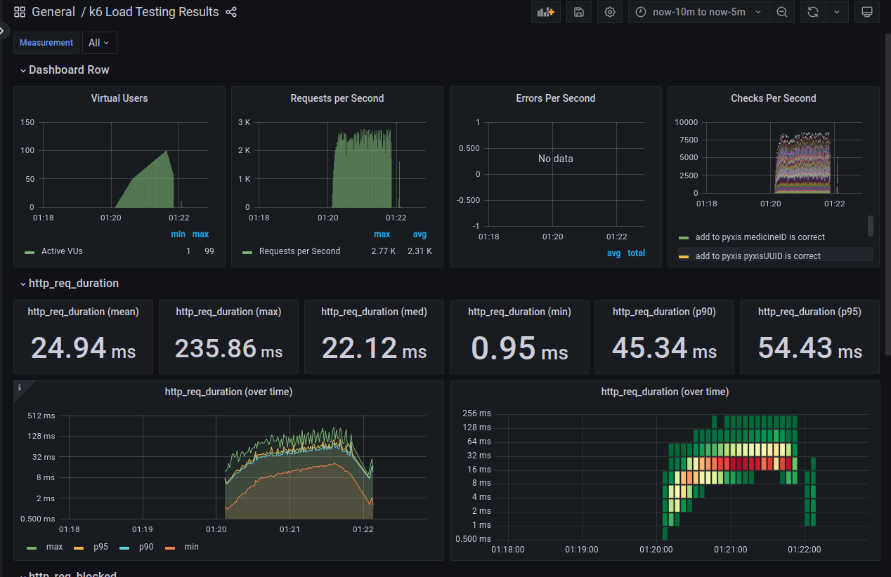

Os testes de carga são essenciais para garantir que um sistema possa lidar com a demanda esperada de usuários e transações, sem comprometer sua performance, estabilidade ou segurança. Nesta documentação, exploraremos o que são testes de carga, sua importância para decisões arquiteturais do sistema, e como o framework TypeScript k6 pode ser utilizado para implementá-los.

## O que são testes de carga?

Testes de carga são uma forma de avaliar o comportamento de um sistema sob condições de carga simuladas, onde a carga pode representar o número de usuários simultâneos, transações por segundo, volume de dados, entre outros. O objetivo principal é identificar possíveis gargalos, falhas de performance e determinar a capacidade máxima do sistema.

## Importância para decisões arquiteturais do sistema

Os testes de carga desempenham um papel crucial na definição da arquitetura do sistema, pois fornecem insights valiosos sobre o desempenho e escalabilidade da aplicação. Com base nos resultados dos testes de carga, os arquitetos de sistemas podem:

    - Identificar e mitigar possíveis gargalos de performance.
    - Dimensionar adequadamente os recursos necessários, como servidores, bancos de dados e redes.
    - Validar se as tecnologias e frameworks escolhidos são adequados para lidar com a carga prevista.
    - Projetar estratégias de escalabilidade horizontal ou vertical conforme necessário.
    - Estimar os custos operacionais associados à infraestrutura de hospedagem e manutenção do sistema.

## O framework TypeScript k6

O k6 é uma ferramenta de teste de carga de código aberto e oferece suporte para scripts escritos em JavaScript ou TypeScript. Ele se destaca por sua simplicidade de uso, eficiência e capacidade de execução de testes distribuídos.
Características principais do k6:

    - JavaScript/TypeScript: Permite escrever scripts de teste utilizando a linguagem familiar JavaScript ou TypeScript, o que facilita a integração com outras ferramentas e frameworks.
    - Sintaxe Limpa: Possui uma sintaxe limpa e fácil de entender, o que simplifica a criação e manutenção de scripts de teste.
    - Suporte a HTTP/HTTPS: Oferece suporte nativo para testes de carga em aplicações web, permitindo simular requisições HTTP/HTTPS e analisar o desempenho do servidor.
    - Métricas e Thresholds: Permite definir métricas de desempenho e thresholds para avaliar se o sistema atende aos requisitos de performance estabelecidos.
    - Execução Distribuída: Capacidade de distribuir a execução de testes em vários nós, facilitando a simulação de grandes volumes de usuários.
    - Integração com CI/CD: Pode ser facilmente integrado a pipelines de CI/CD para automatizar a execução de testes de carga em cada versão do sistema.

## Executando testes de carga com k6

Para executar o script de teste de carga com k6, basta instalar o k6 CLI e executar o comando `k6 run` com o arquivo de script como argumento:

import { Steps } from '@astrojs/starlight/components';

<Steps>

1. Navegue até a pasta `load-test`:

    ```bash title="Terminal"
    cd src/load-test
    ```

2. Tenha executado a API localmente ou remotamente, para isso, siga os passos descritos na documentação de [configuração do ambiente de desenvolvimento](/2024-1B-T02-EC10-G03/sprint-2/system/setup/development/) ou [configuração do ambiente de produção](/2024-1B-T02-EC10-G03/sprint-2/system/setup/production/), conforme necessário.

3. Execute o docker compose para subir o ambiente de teste:

    Para o servidor executado localmente:

    ```bash title="Terminal"
    HOST_IP=$(hostname -I | cut -d' ' -f1) docker compose -f docker-compose.yml up --build
    ```

    Caso o servidor esteja em um ambiente de produção ou em um servidor remoto, substitua o valor de `HOST_IP` pelo IP do servidor:

    ```bash title="Terminal"
    HOST_IP=<ip> docker compose -f docker-compose.yml up --build
    ```

4. O script do K6 será executado e você poderá visualizar as métricas de desempenho obtidas durante o teste pela interface do [grafana](https://grafana.com/) acessando o endereço [http://localhost:3030](http://localhost:3000). Atualmente temos já uma dashboard configurada para visualização das métricas que consome de um banco de dados [InfluxDB](https://www.influxdata.com/).

</Steps>

## Métricas obtidas utilizando o k6

Rodando o teste para a API desenvolvida, obtivemos as seguintes métricas:



Observando as métricas, temos que:

-   **checks** - Número de verificações executadas durante o teste. Houve `100% de sucesso` nas verificações.
-   **http_req_duration** - Duração média, mínima, mediana, máxima e percentis (90 e 95) das requisições HTTP. A duração média foi de `23.23ms`.
-   **http_req_failed** - Porcentagem de falhas nas requisições HTTP. `Não houve falhas` durante o teste.
-   **http_reqs** - Número total de requisições HTTP feitas durante o teste. Foram feitas `288975 requisições`, com uma taxa de `2403.96 requisições por segundo`,
-   **iteration_duration** - Duração média, mínima, mediana, máxima e percentis (90 e 95) das iterações. A duração média foi de `584.73ms`.
-   **iterations** - Número total de iterações executadas durante o teste. Foram executadas `11559 iterações`, com uma taxa de `96.158453 iterações por segundo`.

Assim, como podemos observar, o teste foi bem sucedido, sem falhas e com uma taxa de requisições e iterações satisfatória com base nos parâmetros definidos de:

-   Duração média das requisições HTTP menor que 50ms.
-   Percentil 95 das requisições HTTP menor que 150ms.
-   Duração máxima das requisições HTTP menor que 500ms.
-   Taxa de falhas nas requisições HTTP menor que 1%.
-   50 usuários virtuais no ramp-up, 100 usuários virtuais no estado estável e 0 usuários virtuais no ramp-down.

## Conclusão

Os testes de carga desempenham um papel fundamental no desenvolvimento de sistemas robustos e escaláveis. O framework TypeScript k6 oferece uma maneira eficaz e simplificada de realizar esses testes, permitindo identificar e corrigir problemas de desempenho antes que afetem os usuários finais. Integrar testes de carga em pipelines de CI/CD pode ajudar a garantir que o sistema atenda aos requisitos de performance em cada versão lançada.
