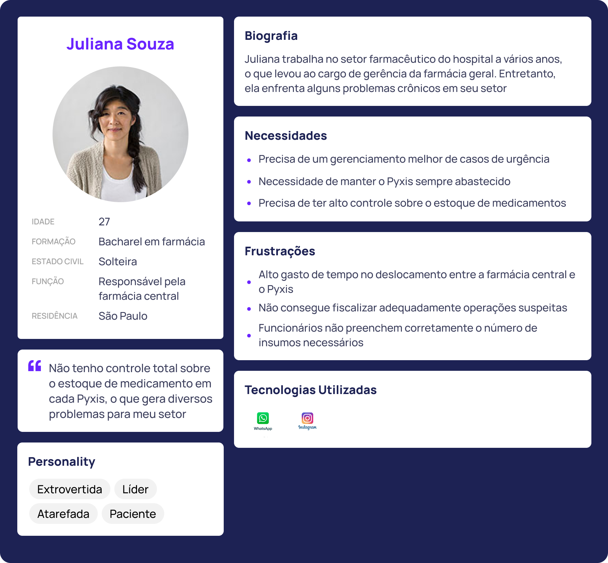

## Persona: Juliana Souza

### Biografia
Juliana trabalha no setor farmacêutico do hospital há vários anos, o que a levou ao cargo de gerência da farmácia geral. Entretanto, ela enfrenta alguns problemas crônicos em seu setor.

### Necessidades
- Precisa de um gerenciamento melhor de casos de urgência.
- Necessidade de manter o Pyxis sempre abastecido.
- Precisa ter alto controle sobre o estoque de medicamentos.

### Detalhes Pessoais
- **Idade:** 27
- **Formação:** Bacharel em farmácia
- **Estado Civil:** Solteira
- **Localização:** São Paulo

### Frustrações
- Alto gasto de tempo no deslocamento entre a farmácia central e o Pyxis.
- Não consegue fiscalizar adequadamente operações suspeitas.
- Funcionários não preenchem corretamente o número de insumos necessários.

### Tecnologias Utilizadas
- Personality: Extrovertida, Líder, Atarefada, Paciente

---

## Persona: Felipe Mello

### Biografia
Felipe começou a trabalhar no hospital há alguns meses, mas ainda não se adaptou completamente à utilização do sistema de solicitação de medicamentos.

### Necessidades
- Precisa de um jeito rápido e fácil de pedir medicamentos.
- Preciso de um jeito para pedir medicamentos com urgência.
- O sistema precisa ser rápido e fácil de usar.

### Detalhes Pessoais
- **Idade:** 30
- **Formação:** Técnico em enfermagem
- **Estado Civil:** Casado
- **Localização:** São Paulo

### Frustrações
- Grandes dificuldades de solicitação de medicamentos em casos de urgência.
- Despende muito tempo no preenchimento da solicitação de insumos.

### Tecnologias Utilizadas
- Personality: Introvertido, Ansioso, Impaciente, Atarefado

---

## Persona: Rodrigo Faro

### Biografia
Rodrigo trabalha como técnico de farmácia em um hospital renomado há cerca de cinco anos. Ele é conhecido por sua habilidade em lidar com situações de urgência e sua atenção aos detalhes no gerenciamento de estoques de medicamentos.

### Necessidades
- Eficiência no atendimento de urgências.
- Gerenciamento de estoque.
- Facilidade de uso.

### Detalhes Pessoais
- **Idade:** 35
- **Formação:** Técnico em farmácia
- **Estado Civil:** Casado
- **Localização:** São Paulo

### Frustrações
- Demora no acesso às informações sobre o estoque de medicamentos.
- Falta de integração entre os sistemas utilizados no hospital.
- Dificuldades em identificar e resolver inconsistências nos registros de estoque.

### Tecnologias Utilizadas
- Personality: Pragmático, Organizado, Colaborativo
