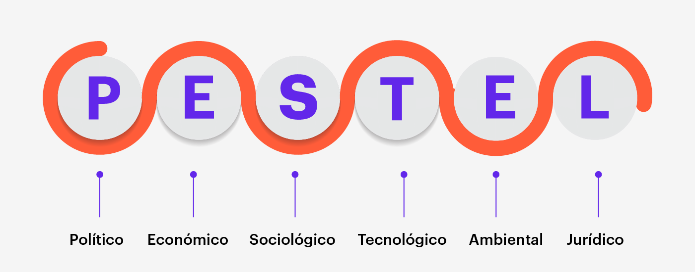

# Introdução

A análise P.E.S.T.E.L é uma ferramenta estratégica que permite identificar fatores externos que podem impactar a organização. A análise é dividida em seis categorias principais: Política, Econômica, Social, Tecnológica, Ambiental e Legal. A análise P.E.S.T.E.L é uma ferramenta valiosa para entender o ambiente externo e antecipar possíveis mudanças que possam afetar a organização.

# Contexto do Projeto

O projeto **Pyxis Vulture** tem como objetivo desenvolver um sistema de monitoramento de chamados em redes hospitalares. O sistema permitirá que os hospitais monitorem e gerenciem os chamados de forma eficiente, garantindo um atendimento rápido e eficaz aos internos, na tangente de abastecimento de medicações, manutenção de equipamentos e infraestrutura hospitalar. 

Dado o contexto, seguiremos para os tópicos análisados.

## Política

No quesito político, por estar situado na área da saúde, o projeto **Pyxis Vulture** está sujeito a regulamentações e políticas governamentais rigorosas. Uma vez que o setor já é altamente regulamentado, é importante garantir que o aplicativo siga as normas vigentes no que tange a proteção de dados, privacidade e segurança dos pacientes, evitando penalidades e sanções legais.

### Estabilidade Política

A estabilidade política é um fator importante a ser considerado, uma vez que mudanças políticas podem afetar a legislação e regulamentação do setor de saúde, trazendo incertezas e desafios adicionais para o projeto.

### Políticas Fiscais

Já em âmbito fiscal, vê-se impacto neutro à possivelmente negativo no projeto, partindo do pressuposto que a solução tecnológica proposta não depende de aparatos físicos, hardware ou infraestrutura física, que comprometessem sua viabilidade financeira. Contudo, como cita a análise de Juliana Passos à "Escola Politécnica de Saúde Joaquim Venâncio" em 2022, [O que setor privado quer para a saúde do Brasil?](https://www.epsjv.fiocruz.br/noticias/reportagem/o-que-setor-privado-quer-para-a-saude-do-brasil), as alas hospitalares privadas demandam mais linhas de crédito especial e incentivos governamentais para a expansão do uso de tecnologia em saúde e maior participação nas decisões da esfera pública, fator que representa um risco para o projeto dada sua natureza inovadora e dependente de financiamento. 

### Relações Internacionais

No aspecto de relações internacionais, a solução **Pyxis Vulture** pode se beneficiar de parcerias internacionais para expandir sua presença global e acessar novos mercados, em função da globalização e da crescente interconectividade entre os países. Porém, cabe ressaltar que a legislação de cada país pode variar, o que pode impactar a implementação do aplicativo em diferentes regiões, desta forma entende-se que o impacto é neutro com tendência a positivo, mas com baixa probabilidade de ocorrência.

### Políticas de Emprego

Agora sobre políticas de emprego, vê-se um impacto possívelmente negativo, uma vez que a implementação do aplicativo pode levar à automação de certas tarefas da gestão hospitalar, como o abastecimento de medicações e controle de estoque, o que pode resultar em redução de empregos em detrimento da eficiência e redução de custos. 

É fundamental que durante a implementação do projeto **Pyxis Vulture** sejam considerados fatores como a capacitação dos funcionários para o uso do aplicativo e a requalificação dos profissionais afetados pela automação.

## Econômica

Os fatores econômicos que circunscrevem a solução tem papel fundamental na análise de sua viabilidade, pensando em custos, financiamento e retorno sobre o investimento.

### Crescimento Econômico

A saúde pode ser encarada como ativo fundamental na vida de qualquer ser humana, não só no que tange a melhoria da qualidade de vida, mas também sua manutenção constante, tendo em vistas que sua demanda é inelástica, independente da município, estado ou país, é fundamental que se pense em como ampliar seus benefícios, contudo atentando-se devidamente à que custo e como financiar tais melhorias.

Desta forma, corroborando com a tendência de digitalização do setor, marcada principalmente pela necessidade de reduzir custos e eficiência operacional, a solução desenvolvida entra em acordo com a análise feita pela consultoria Deloitte, [Perspectivas globais para o setor de Saúde 2024](https://www2.deloitte.com/br/pt/pages/life-sciences-and-healthcare/articles/global-health-care-outlook.html), onde são pontuadas as principais tendências e desafios para o setor de saúde, como a digitalização, a necessidade de redução de custos, envelhecimento da população e a necessidade de maior eficiência operacional.

Tendo em vista tal cenário, o impacto potencial da solução é positivo, uma vez que a digitalização do setor de saúde pode contribuir para a redução de custos e melhoria da eficiência operacional, o que pode resultar em um crescimento econômico sustentável à longo prazo para redes hospitalares.

### Taxas de juros

A taxa de juros tem um papel fundamental na viabilidade do projeto, uma vez que afeta diretamente o custo de financiamento e o retorno sobre o investimento. Seguindo a economia mundial, o Brasil deve seguir com alta na taxa de juros decorrente da crescente inflação no mercado americano, como demonstrado pela matéria de Marcelo Azevedo à Folha de São Paulo, [Juros de longo prazo voltam a subir com incertezas nos EUA e no cenário fiscal do Brasil](https://www1.folha.uol.com.br/mercado/2024/04/juros-de-longo-prazo-voltam-a-subir-com-incertezas-nos-eua-e-no-cenario-fiscal-do-brasil.shtml), tem-se um cenário desfavorável para a captação de recursos e investimentos em projetos inovadores, como o **Pyxis Vulture**, assim pode-se entender que o impacto é negativo, com alta propabilidade de ocorrência, tornando-se um risco para o projeto à longo prazo.

## Social

No aspecto social, deflagram-se dois aspectos fundamentais que devem ser considerados

1. Envelhecimento da população: Com uma população que está envelhecendo, há uma demanda crescente por serviços de saúde eficientes, e um aplicativo que agilize chamados pode ser muito benéfico.
2. Expectativas dos profissionais de saúde: A aceitação do aplicativo pelos usuários finais (enfermeiros, técnicos de farmácia, equipe de manutenção) é vital para o sucesso do projeto.

## Tecnologia

### Infraestrutura Tecnológica

A infraestrutura tem um impacto potencialmente positivo, com alta probabilidade de influenciar o projeto. Hospitais que contam com uma boa infraestrutura podem integrar mais facilmente soluções tecnológicas. Para capitalizar essa oportunidade, o projeto deve focar em hospitais ou redes hospitalares que apresentem certo grau de digitalização, como o Sírio Libanês. 

### Nível de Inovação 

A tecnologia tem estado cada vez mais presente no dia a dia de diversos setores da sociedade, na saúde não seria diferente, como João Pedro, médico, à revista Star Med "Como em outras indústrias e campos da economia, as empresas que investem constantemente nos avanços de tecnologia em cuidados de saúde podem auferir uma série de vantagens neste competitivo mercado", [Tecnologia na saúde: o que é, vantagens e tendências](https://star.med.br/tecnologia-na-saude-o-que-e/), o que representa um fator positivo para o projeto, uma vez que a introdução de inovações pode otimizar significativamente as operações, principalmente no quesito custo. 

Para capitalizar tal público, hospitais com setores de inovação, poderia promover workshops e palestras sobre o projeto, demonstrando sua funcionalidade e a melhoria na gestão de recursos e qualidade de serviço gerada para aqueles que o utilizam.

### Adoção de Novas Tecnologias

A adoção de novas tecnologias no projeto é crucial e também tem um impacto positivo, com uma probabilidade média de impactar o projeto. A implementação do Pyxis Vulture requer que os funcionários do hospital adotem a nova aplicação móvel. Para maximizar essa adoção, é recomendável realizar sessões de treinamento e oferecer suporte técnico contínuo para garantir que os usuários se sintam confortáveis e confiantes ao utilizar o novo sistema

### Investimento em P&D

Finalmente, o investimento em pesquisa e desenvolvimento tem um impacto positivo potencial, embora com uma probabilidade baixa devido a restrições de orçamento. Investir em pesquisa para continuar aprimorando o Pyxis Vulture pode levar a melhorias personalizadas que atendam às necessidades específicas do hospital. Estrategicamente, seria benéfico buscar parcerias ou financiamento externo para apoiar a inovação contínua e o desenvolvimento do sistema.

Como citado anteriormente, a digitalização do setor de saúde é uma tendência global, e a adoção de novas tecnologias é fundamental para aprimorar a eficiência operacional e a qualidade dos serviços prestados. Contudo a falta de linhas de crédito especial e incentivos governamentais para a expansão do uso de tecnologia em saúde e maior participação nas decisões da esfera pública resultam em um ofensor à inovação, o que pode comprometer a viabilidade do projeto à longo prazo.

## Ambiental

1. Sustentabilidade: Hospitais estão cada vez mais focados em reduzir seu impacto ambiental. O aplicativo pode contribuir para isso ao reduzir a necessidade de papel e otimizar o uso de recursos.

## Legal

1. Proteção de dados: A conformidade com leis de proteção de dados, como a LGPD no Brasil ou a GDPR na Europa, é essencial, considerando que o aplicativo lidará com informações sensíveis dos pacientes.
2. Normas técnicas: O aplicativo deve atender a normas técnicas específicas para software utilizado em ambientes de saúde, garantindo segurança e confiabilidade.