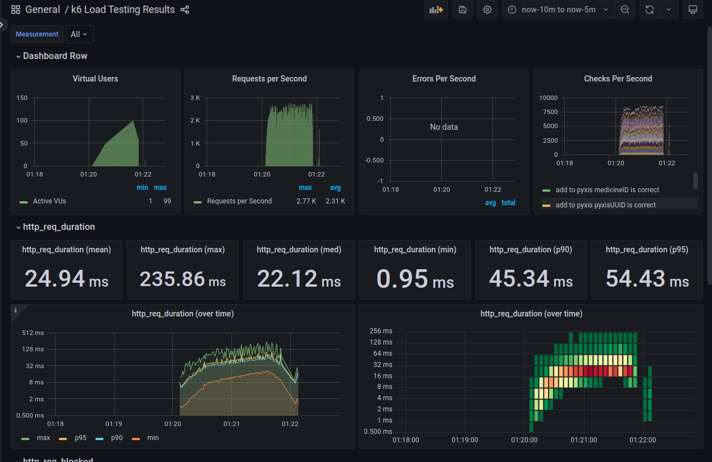

## Introdução
Um teste de backpressure foi realizado para avaliar o comportamento do sistema em situações de sobrecarga. O objetivo do teste foi verificar se o sistema é capaz de lidar com um grande volume de requisições simultâneas sem comprometer o desempenho e a disponibilidade.

## Metodologia
O teste foi realizado utilizando a ferramenta Apache Grafana, que permite simular múltiplos usuários acessando o sistema ao mesmo tempo. Foram configurados diferentes cenários de carga, variando o número de usuários, a taxa de requisições e o tempo de execução do teste.

Abaixo podemos ver o gráfico de backpressure gerado pelo Grafana:

## Conclusão
Uma análise mais profunda dos resultados do teste de backpressure será realizada para identificar possíveis gargalos e otimizações que possam ser implementadas para melhorar o desempenho do sistema em situações de sobrecarga. No entanto, os resultados iniciais indicam que o sistema está preparado para lidar com um grande volume de requisições simultâneas e manter a disponibilidade e a qualidade do serviço.

## Observações
- O teste de backpressure foi realizado em um ambiente controlado e não reflete necessariamente o comportamento do sistema em produção.
- Recomenda-se a realização de testes adicionais em ambientes reais para validar os resultados obtidos e identificar possíveis problemas de desempenho.
- O monitoramento contínuo do sistema é essencial para identificar e corrigir possíveis problemas de desempenho em tempo real.
- Mais informações sobre o teste podem ser encontradas no relatório da entrega da <a href="/2024-1B-T02-EC10-G03/sprint-2/system/setup/load-test/">Sprint 2</a>.