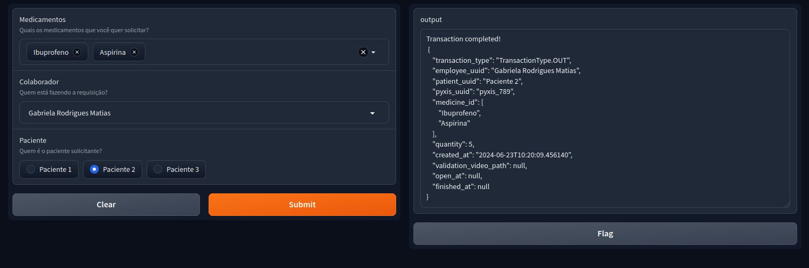

## Simulador Pyxis

Para aumentar a fidelidade da solução como Prova de Conceito (POC), decidiu-se criar um simulador Pyxis físico. O intuito com a confecção do simulador é permitir que o usuário possa interagir com o sistema de forma mais realista, simulando a utilização de um Pyxis real.

### Materiais
Para a confecção do simulador, foram utilizados os seguintes materiais:
- 1x Raspberry Pi 5
- 1x Relê de 5V
- 1x Conversor de 5V para 3.3V
- 1x Trava elétrica (Solenóide 12V)
- 1x Fonte de alimentaçao 5V (para o Raspberry Pi)
- 1x Fonte de alimentação 12V (para a trava elétrica)

O esquemático do sistema pode ser visto abaixo:

### Interface

Devido à utilização de modelos de inteligência artificial para fazer a análise de medicamentos retirados do Pyxis, foi necessário criar uma interface para fazer a verificação dos vídeos capturados. Para isso, utilizamos o Gradio, uma biblioteca de Python que permite a criação de interfaces gráficas para modelos de IA.

Num primeiro momento, a interface apenas possuia um botão para acionar o relê, o qual servirá como _trigger_ para a captura de um vídeo. Após a captura, o vídeo é enviado para o modelo de IA, que faz a análise e retorna o resultado.

