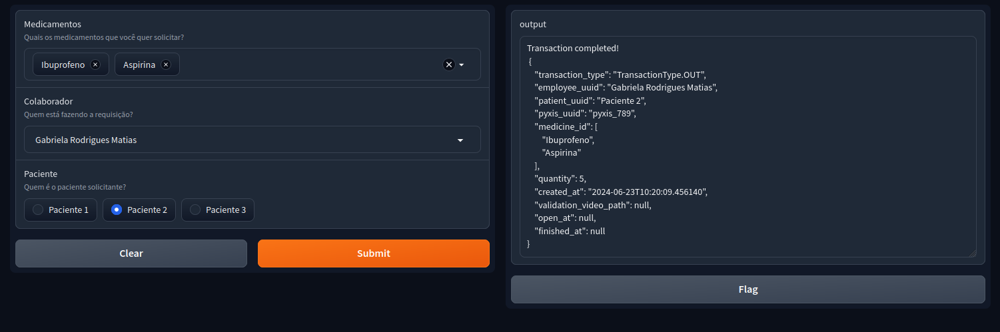

## Integração do Simulador Pyxis com Câmera

Dando continuidade ao desenvolvimento do Simulador Pyxis físico iniciado na sprint passada, foram adicionadas as funcionalidades:   
  - Melhoria da interface do Simulador Pyxis utilizando Gradio
  - Adição da funcionalidade de gravação da câmera relacionado ao estado da porta 
  - Envio dos vídeos à um bucket na AWS para posterior análise 
  - Envio de informações da transação por meio do sistema de mensageria Kafka para validação no banco

### Melhoria da Interface Pyxis

Utilizamos a biblioteca Gradio do Python para construir uma interface que simulasse a utilização do Pyxis real. Pensando no projeto como uma prova de conceito, optamos por construir um sistema simples, porém inteiramente funcional e utilizável, para representação das funcionalidades básicas do Pyxis, como **demonstração dos remédios disponíveis**, **colaborador responsável pela retirada** e **paciente solicitante da retirada**.

Além de nos permitir simular toda a operação, permite-nos também aplicar o fluxo de gravação de vídeos e validação de transações a partir dos dados coletados no processo de solicitação de medicamentos.

A interface pode ser observada abaixo:

Entendendo a Interface:
  - O campo **Medicamentos** mostra todos os medicamentos disponível naquela unidade Pyxis no momento.
  - O campo **Colaborador** mostra os possíveis colaboradores que podem fazer requisições e retiradas.
  - O campo **Paciente** mostra os possíveis pacientes que podem ter solicitado os medicamentos.

Todas essas informações são então combinadas para construir uma *transação* que são enviadas através do Kafka (Sistema de mensageria) para uma máquina que ficará responsável pela sua validação e inserção desta em um banco de dados. 
  
  - O campo ***output*** retorna o status da transação - se foi concluída com sucesso ou houve erro - e indica o corpo da transação que será enviada para o banco de dados.  

### Visão computacional

Pensando na validação de transações para análise de possíveis operações suspeitas e errôneas, implementamos um sistema de gravação que é acionado quando uma retirada acontece. Para os testes, utilizamos uma **câmera com conexão USB** para conectar ao *Raspberry Pi* que faz o controle da abertura e fechamento do *simulador Pyxis*.

Paralelamente à abertura do *Pyxis*, o **sistema da câmera** inicia e faz a gravação da transação. Quando a transação é finalizada (por meio do fechamento da porta), a gravação é finalizada e então, o vídeo é enviado para um ***Bucket*** em um **sistema em Nuvem** (Atualmente ***AWS***) para armazenamento e posterior análise por um modelo de visão computacional que fará a contagem dos itens e a validação da transação. Essas informações ficarão disponíveis posteriormente para pessoas com cargos administrativos em um dashboard.

### Vídeo de demonstração:

<iframe id="ytplayer" type="text/html" width="1280" height="720" src="https://youtube.com/embed/Qdv_x43oPTk" allowfullscreen="allowfullscreen" mozallowfullscreen="mozallowfullscreen" msallowfullscreen="msallowfullscreen" oallowfullscreen="oallowfullscreen" webkitallowfullscreen="webkitallowfullscreen" frameborder="0"/> 

